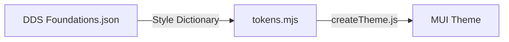

# Style Dictionary Integration Guide

## Overview
Style Dictionary is a build system that allows you to define styles once, in a way for any platform or language to consume. It provides a single source of truth for your design tokens.

## Toolchain
```
DDS Foundations.json → Style Dictionary → tokens.mjs → createTheme.js → MUI Theme
```

## Installation
```bash
npm install style-dictionary @tokens-studio/sd-transforms --save-dev
```

## Core Concepts

### 1. Token Structure
Tokens are organized in a hierarchical structure:
```json
{
  "color": {
    "base": {
      "gray": {
        "light": { "$value": "#CCCCCC" },
        "medium": { "$value": "#999999" },
        "dark": { "$value": "#111111" }
      }
    }
  }
}
```

### 2. Build Process


## Configuration

### Basic Configuration
Create `config/style-dictionary.config.mjs`:
```javascript
import StyleDictionary from 'style-dictionary';
import { register } from '@tokens-studio/sd-transforms';

register(StyleDictionary);

export default {
  source: ['token-studio-sync-provider/DDS Foundations.json'],
  platforms: {
    js: {
      transformGroup: 'tokens-studio',
      buildPath: 'build/',
      files: [{
        destination: 'tokens.mjs',
        format: 'javascript/es6',
        options: {
          showFileHeader: true
        }
      }]
    }
  }
};
```

### Key Configuration Options
- `source`: Path to DDS Foundations.json
- `platforms`: Output configurations
- `transformGroup`: Set of transforms to apply
- `buildPath`: Output directory
- `files`: Output file configurations

## Token Types and Formats

### Supported Types
- Colors
- Sizes
- Typography
- Spacing
- Border Radius
- Shadows
- Custom types

### Value Formats
- Hex colors
- RGB/RGBA
- Pixels
- Percentages
- Numbers
- Strings

## Platform-Specific Output

### JavaScript/ES6 Module
```javascript
// build/tokens.mjs
export const colorBlue500 = '#1976d2';
export const colorBlue300 = '#42a5f5';
export const colorBlue700 = '#1565c0';
// ... other tokens
```

## Integration Steps

1. **Setup Project Structure**
   ```
   project/
   ├── token-studio-sync-provider/
   │   └── DDS Foundations.json
   ├── config/
   │   └── style-dictionary.config.mjs
   ├── src/
   │   └── theme/
   │       ├── createTheme.js
   │       └── ThemeProvider.js
   └── build/
       └── tokens.mjs
   ```

2. **Define Tokens**
   - Use DDS Foundations.json as source
   - Follow DTCG format
   - Include necessary metadata

3. **Configure Build**
   - Set up Style Dictionary config
   - Define output format
   - Configure transforms

4. **Build Process**
   ```bash
   npm run build:tokens
   ```

## Best Practices

1. **Token Organization**
   - Use semantic naming
   - Group related tokens
   - Maintain consistent structure

2. **Build Process**
   - Watch for token changes
   - Validate output formats
   - Generate type definitions

3. **Platform Integration**
   - Test output
   - Verify token usage
   - Document requirements

4. **Maintenance**
   - Version control
   - Document changes
   - Maintain compatibility

## Common Issues and Solutions

1. **Reference Resolution**
   - Ensure proper token structure
   - Check for circular references
   - Verify token paths

2. **Platform Compatibility**
   - Test output on all platforms
   - Verify value formats
   - Check unit conversions

3. **Build Performance**
   - Optimize token structure
   - Use appropriate filters
   - Implement caching

## Development Workflow

1. **Local Development**
   ```bash
   style-dictionary build --watch
   ```

2. **Testing**
   - Verify token structure
   - Test platform outputs
   - Check value transformations

3. **Deployment**
   - Build for production
   - Verify outputs
   - Deploy to appropriate locations

## Resources

- [Style Dictionary Documentation](https://styledictionary.com)
- [DTCG Specification](https://design-tokens.github.io/community-group/format/)
- [Example Projects](https://styledictionary.com/examples/)
- [API Reference](https://styledictionary.com/reference/)
    

    

    


    

    