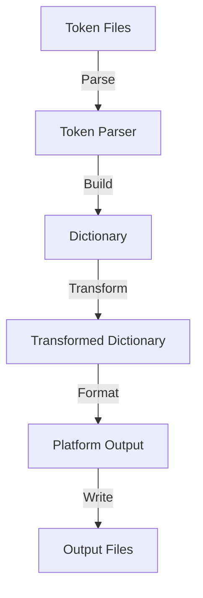

# Style Dictionary Architecture

## Core Components

### 1. Token Parser
- Parses JSON token files into JavaScript objects
- Supports multiple file formats
- Handles file system operations
- Manages file watching in development

### 2. Dictionary Builder
- Combines parsed token files
- Resolves references between tokens
- Creates a single source of truth
- Maintains token hierarchy

### 3. Transform System
- Modifies token values
- Handles unit conversions
- Applies platform-specific transformations
- Supports custom transformations

### 4. Format System
- Determines output structure
- Generates platform-specific code
- Handles file formatting
- Supports custom formats

### 5. Platform Builder
- Manages build configurations
- Handles platform-specific settings
- Controls output destinations
- Manages file headers

## Data Flow



## Key Concepts

### Token Processing
1. **Parsing**: Token files are read and parsed into JavaScript objects
2. **Combining**: Multiple token files are merged into a single dictionary
3. **Transforming**: Values are transformed based on platform requirements
4. **Formatting**: Transformed values are formatted for output
5. **Writing**: Formatted values are written to output files

### Reference Resolution
- Tokens can reference other tokens
- References are resolved during dictionary building
- Circular references are detected and handled
- Nested references are supported

### Platform Independence
- Tokens are platform-agnostic
- Platform-specific transformations are applied during build
- Multiple platform outputs can be generated
- Platform-specific formats are supported

## Extension Points

### Custom Transforms
```javascript
StyleDictionary.registerTransform({
  name: 'custom/transform',
  type: 'value',
  matcher: (prop) => prop.attributes.category === 'custom',
  transformer: (prop) => transformValue(prop.value)
});
```

### Custom Formats
```javascript
StyleDictionary.registerFormat({
  name: 'custom/format',
  formatter: (dictionary, config) => {
    return formatTokens(dictionary.allProperties);
  }
});
```

### Custom Actions
```javascript
StyleDictionary.registerAction({
  name: 'custom/action',
  do: (dictionary, config) => {
    // Custom action logic
  }
});
```

## Build Process

1. **Configuration Loading**
   - Load and validate configuration
   - Set up build environment
   - Initialize components

2. **Token Processing**
   - Parse token files
   - Build dictionary
   - Apply transforms
   - Resolve references

3. **Output Generation**
   - Format tokens
   - Generate platform-specific code
   - Write output files
   - Run actions

## Performance Considerations

### Build Optimization
- Use appropriate file watching
- Implement caching
- Optimize transform operations
- Minimize file I/O

### Memory Management
- Handle large token sets
- Manage reference resolution
- Optimize dictionary structure
- Clean up resources

## Development Workflow

### Local Development
```bash
style-dictionary build --watch
```

### Production Build
```bash
style-dictionary build
```

### Testing
- Verify token structure
- Test transformations
- Check output formats
- Validate references

## Best Practices

1. **Token Organization**
   - Use semantic naming
   - Group related tokens
   - Maintain consistent structure
   - Document token usage

2. **Build Configuration**
   - Use appropriate transforms
   - Configure platform settings
   - Set up file headers
   - Define output formats

3. **Performance**
   - Optimize token structure
   - Use efficient transforms
   - Implement caching
   - Monitor build times

## Resources

- [Style Dictionary Documentation](https://styledictionary.com)
- [Architecture Guide](https://styledictionary.com/info/architecture/)
- [API Reference](https://styledictionary.com/reference/)
- [Example Projects](https://styledictionary.com/examples/)