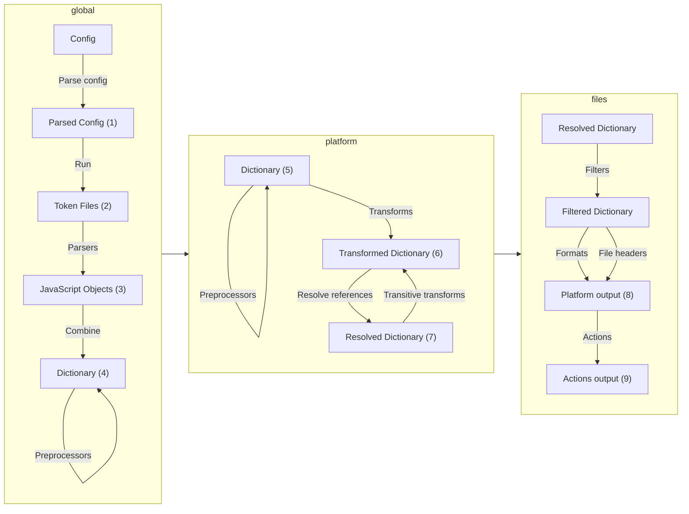

# Style Dictionary Integration Guide

## Overview
Style Dictionary is a build system that allows you to define styles once, in a way for any platform or language to consume. It provides a single source of truth for your design tokens.

## Installation
```bash
npm install style-dictionary --save-dev
```

## Core Concepts

### 1. Token Structure
Tokens are organized in a hierarchical structure:
```json
{
  "color": {
    "base": {
      "gray": {
        "light": { "$value": "#CCCCCC" },
        "medium": { "$value": "#999999" },
        "dark": { "$value": "#111111" }
      }
    }
  }
}
```

### 2. Build Process


## Configuration

### Basic Configuration
Create a `config.json`:
```json
{
  "source": ["tokens/**/*.json"],
  "platforms": {
    "scss": {
      "transformGroup": "scss",
      "buildPath": "build/scss/",
      "files": [{
        "destination": "_variables.scss",
        "format": "scss/variables"
      }]
    }
  }
}
```

### Key Configuration Options
- `source`: Array of paths to token files
- `platforms`: Output configurations for different platforms
- `transformGroup`: Set of transforms to apply
- `buildPath`: Output directory
- `files`: Array of output file configurations

## Token Types and Formats

### Supported Types
- Colors
- Sizes
- Typography
- Spacing
- Border Radius
- Shadows
- Custom types

### Value Formats
- Hex colors
- RGB/RGBA
- Pixels
- Percentages
- Numbers
- Strings

## Platform-Specific Output

### CSS/SCSS
```scss
$color-base-gray-light: #CCCCCC;
$color-base-gray-medium: #999999;
$color-base-gray-dark: #111111;
```

### JavaScript
```javascript
module.exports = {
  color: {
    base: {
      gray: {
        light: '#CCCCCC',
        medium: '#999999',
        dark: '#111111'
      }
    }
  }
}
```

## Customization

### Custom Transforms
```javascript
StyleDictionary.registerTransform({
  name: 'size/px',
  type: 'value',
  matcher: function(prop) {
    return prop.attributes.category === 'size';
  },
  transformer: function(prop) {
    return `${prop.value}px`;
  }
});
```

### Custom Formats
```javascript
StyleDictionary.registerFormat({
  name: 'custom/format',
  formatter: function(dictionary, config) {
    return dictionary.allProperties
      .map(prop => `${prop.name}: ${prop.value}`)
      .join('\n');
  }
});
```

## Integration Steps

1. **Setup Project Structure**
   ```
   project/
   ├── tokens/
   │   ├── colors.json
   │   ├── typography.json
   │   └── spacing.json
   ├── config.json
   └── build/
   ```

2. **Define Tokens**
   - Create token files in JSON format
   - Use proper structure and naming conventions
   - Include necessary metadata

3. **Configure Build**
   - Set up platform-specific configurations
   - Define output formats
   - Configure transforms

4. **Build Process**
   ```bash
   style-dictionary build
   ```

## Best Practices

1. **Token Organization**
   - Use semantic naming
   - Group related tokens
   - Maintain consistent structure

2. **Value Management**
   - Use references for shared values
   - Keep values platform-agnostic
   - Use appropriate units

3. **Build Optimization**
   - Use filters to reduce output
   - Implement proper transforms
   - Cache builds when possible

## Common Issues and Solutions

1. **Reference Resolution**
   - Ensure proper token structure
   - Check for circular references
   - Verify token paths

2. **Platform Compatibility**
   - Test output on all platforms
   - Verify value formats
   - Check unit conversions

3. **Build Performance**
   - Optimize token structure
   - Use appropriate filters
   - Implement caching

## Development Workflow

1. **Local Development**
   ```bash
   style-dictionary build --watch
   ```

2. **Testing**
   - Verify token structure
   - Test platform outputs
   - Check value transformations

3. **Deployment**
   - Build for production
   - Verify outputs
   - Deploy to appropriate locations

## Resources

- [Style Dictionary Documentation](https://styledictionary.com)
- [DTCG Specification](https://design-tokens.github.io/community-group/format/)
- [Example Projects](https://styledictionary.com/examples/)
- [API Reference](https://styledictionary.com/reference/)
    

    

    


    

    